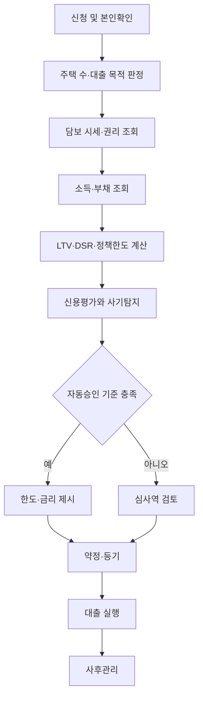

좋습니다. 범위가 명확해졌습니다.

> 은행이 개인 고객에게 직접 실행하는 주택담보대출  
> 담보 대상은 주택, 용도는 구입·대환·생활안정자금

이 조건이면 명세는 단순 상품소개서가 아니라 **상품정의 + 정책판정 + 신용·담보심사 + 계약·실행 + 사후관리**까지 포함해야 합니다.

아래와 같은 형태를 1차 상품 명세로 제안합니다.

# 개인 주택담보대출 상품 명세 v0.1

기준일: 2026년 8월 12일  
대상 업권: 은행  
대상 고객: 개인  
판매 방식: 은행 직접 판매·실행

## 1. 상품 개요

| 항목      | 제안 내용                                        |
| --------- | ------------------------------------------------ |
| 상품명    | 안심 주택담보대출                                |
| 고객      | 만 19세 이상 개인                                |
| 대상 주택 | 아파트·연립·다세대·단독주택                      |
| 대출 목적 | 구입자금·대환자금·생활안정자금                   |
| 금리 유형 | 변동금리·혼합금리·고정금리                       |
| 상환 방식 | 원리금균등·원금균등                              |
| 대출기간  | 10·15·20·30·40년                                 |
| 거치기간  | 원칙적으로 미운영, 예외 상품만 허용              |
| 담보권    | 해당 주택에 은행 1순위 근저당권 설정             |
| 신청 채널 | 영업점·인터넷·모바일                             |
| 실행 방식 | 매도인·기존 금융기관·차주 지정계좌로 목적별 지급 |

## 2. 대출 목적

### 구입자금

- 주택 매매 또는 분양대금 지급
- 매매계약서 및 계약금 납부내역 확인
- 소유권 이전과 근저당권 설정 동시 진행
- 대출금은 원칙적으로 매도인 또는 법무사 관리계좌에 지급
- 수도권·규제지역 한도 및 주택 수 제한 적용
- 기존 주택 처분조건이 있으면 조건부 승인

### 대환자금

- 다른 금융기관의 기존 주택담보대출 상환
- 기존 대출 잔액과 상환계좌 확인
- 대출금은 기존 금융기관으로 직접 지급
- 기존 근저당 말소와 신규 근저당 설정 연계
- 대환으로 대출금이 증액되는 부분은 신규 대출 규정 적용
- 기존 규정 적용이 가능한 특례가 있으면 별도 정책 코드로 관리

### 생활안정자금

- 주택구입 목적이 아닌 가계자금
- 차주 계좌로 지급 가능
- 구입자금 우회 사용 여부 확인
- 실행 후 일정 기간 주택 추가 취득 여부 점검
- 고액 신청 또는 자금 용도가 불명확한 경우 수동심사

## 3. 신청 자격

다음 요건을 모두 충족해야 합니다.

- 민법상 성년인 개인
- 주민등록번호 및 국내 주소 확인 가능
- 본인 또는 배우자 명의 주택을 담보로 제공
- 안정적인 소득 확인이 가능한 고객
- 신용정보 조회에 동의한 고객
- 담보 제공자와 채무자가 다른 경우 내부 허용 기준 충족
- 금융질서문란·부정대출·명의도용 등 제한 사유가 없는 고객
- 채무자 및 담보제공자가 비대면 본인확인 또는 대면 실명확인을 완료한 고객

### 공동명의

- 모든 소유자의 담보제공 동의 필요
- 공동소유자 전원의 본인확인 필요
- 배우자가 아닌 제3자 공동소유 담보는 수동심사
- 미성년자·피성년후견인 지분이 있으면 원칙적으로 제한

## 4. 정책판정 입력값

정확한 규제 적용을 위해 아래 데이터를 필수로 받아야 합니다.

### 고객·세대 정보

- 신청인 및 배우자
- 혼인 여부
- 세대원
- 주민등록 주소
- 국내 거주 여부
- 생애최초 주택구입 여부
- 신청인·배우자·세대원의 주택 보유 현황
- 분양권·입주권 보유 현황
- 기존 주택 처분 예정 여부

### 담보 정보

- 주소 및 법정동 코드
- 주택 유형
- 전용면적
- 소유자 및 지분
- 매매가격
- KB시세 등 공신력 있는 시세
- 최근 실거래가
- 감정평가액
- 선순위 근저당
- 임대차보증금
- 최우선변제 대상 금액
- 압류·가압류·가처분·전세권
- 위반건축물 여부
- 토지거래허가구역 여부
- 규제지역 여부

### 소득·부채 정보

- 근로·사업·연금·기타소득
- 증빙소득·인정소득·신고소득 구분
- 금융기관 전체 대출
- 대출별 잔액·금리·만기·상환방식
- 신용대출 총액
- 보증부 대출
- 임대보증금 반환채무
- 연간 원리금 상환액

## 5. 대출한도 계산

최종 승인 한도는 다음 중 가장 작은 금액으로 결정합니다.

```text
최종 대출한도 =
MIN(
    LTV 한도,
    DSR 한도,
    지역·주택가격별 정책한도,
    유효담보가액 기준 한도,
    상품 최고한도,
    내부 신용한도,
    고객 신청금액
)
```

### 유효담보가액

```text
인정 담보가액 =
MIN(매매가격, 인정 시세 또는 감정평가액)

유효 담보여력 =
인정 담보가액
- 선순위 채권
- 임차보증금 인정액
- 최우선변제금
- 기타 우선권리
```

### 정책 LTV

2026년 7월 이후 공개 정책을 기준으로 기본 규칙을 다음과 같이 설정할 수 있습니다.

| 대상                       |            제안 판정 |
| -------------------------- | -------------------: |
| 비규제지역 일반 차주       |             최대 70% |
| 규제지역 일반 차주         |             최대 40% |
| 생애최초·정책 특례         | 별도 완화비율 60~70% |
| 다주택자의 수도권 주택구입 |        원칙적으로 0% |
| 주택 매매·임대사업자 목적  |    본 상품 대상 제외 |

다만 실제 적용 비율은 대출 목적, 주택 수, 처분조건, 규제지역 지정일과 경과규정에 따라 달라질 수 있으므로 반드시 정책 테이블로 운영해야 합니다. [금융위원회 규제지역 대출규제 안내](https://www.fsc.go.kr/no010101/87222?srchEndDt=%2F)

### 수도권·규제지역 구입자금 한도

| 주택 시가               | 최대 한도 |
| ----------------------- | --------: |
| 15억원 이하             |     6억원 |
| 15억원 초과~25억원 이하 |     4억원 |
| 25억원 초과             |     2억원 |

상품 자체 한도를 별도로 설정하면 정책한도와 상품한도 중 낮은 값을 적용합니다.

## 6. DSR 심사

### 기본 계산

```text
DSR =
모든 가계대출의 연간 원리금 상환액
÷ 연간 인정소득
× 100
```

은행권 차주단위 DSR 기준은 원칙적으로 40% 이내로 설계하되, 정책상 제외되는 대출·차주와 예외는 별도 규칙으로 관리합니다.

### 스트레스 DSR

실제 적용금리가 아닌 **DSR 심사용 금리**를 별도로 계산해야 합니다.

```text
DSR 심사금리 =
실제 적용금리
+ 금리유형별 스트레스 금리
```

- 변동금리: 스트레스 금리 반영 폭이 가장 큼
- 혼합금리: 고정기간에 따라 반영률 차등
- 장기 고정금리: 상대적으로 낮은 반영률 적용 가능
- 수도권·규제지역: 강화된 스트레스 금리 적용
- 정책 변경 시 시행일 기준 버전 관리

스트레스 DSR은 실제 고객이 납부하는 이자율이 아니라 미래 금리 상승 위험을 반영한 한도 심사 기준이라는 점을 고객에게 구분해 안내해야 합니다. [금융위원회 스트레스 DSR 안내](https://www.fsc.go.kr/po010101/81777?srchCtgry=1&srchKey=sj&srchText=DSR)

## 7. 금리 명세

```text
최종 적용금리 =
기준금리
+ 가산금리
- 우대금리
+ 별도가산금리
```

### 기준금리

- 신규취급액 기준 COFIX
- 신잔액 기준 COFIX
- 금융채 5년물
- 은행 내부 고정금리 기준

### 가산금리 구성

- 신용위험 원가
- 담보위험 원가
- 자본비용
- 업무원가
- 유동성 원가
- 목표이익
- 채널 원가

### 우대금리

- 급여이체
- 자동이체
- 카드 실적
- 전자계약·전자등기
- 생애최초
- 신혼·다자녀
- 사회적 배려 대상
- 고정금리 또는 비거치식 분할상환
- 친환경·에너지효율 주택

우대조건에는 다음 항목이 반드시 있어야 합니다.

- 우대율
- 적용 시작일
- 적용 종료일
- 충족 여부 판단일
- 미충족 시 금리 변경 시점
- 최대 우대 한도
- 중복 적용 가능 여부

## 8. 자동심사 의사결정표

| 조건                     | 결과                    |
| ------------------------ | ----------------------- |
| 본인확인 실패            | 접수 불가               |
| 담보 소유권 불일치       | 수동심사                |
| 주택 수 확인 불가        | 추가서류 요청           |
| 다주택자 수도권 구입자금 | 정책거절                |
| LTV 초과                 | 한도 감액 또는 거절     |
| DSR 40% 초과             | 한도 감액 또는 거절     |
| 시세 확인 불가           | 감정평가 전환           |
| 권리침해 존재            | 수동심사 또는 거절      |
| 선순위 채권 과다         | 한도 감액               |
| 소득 확인 불가           | 인정소득 심사 또는 거절 |
| 최근 연체·부도정보 존재  | 신용정책에 따라 거절    |
| 정책·신용·담보 기준 충족 | 자동승인 후보           |

## 9. 심사 단계



## 10. 필요 서류

### 공통

- 신분증
- 주민등록등본·초본
- 가족관계증명서
- 혼인관계증명서
- 소득·재직 증빙
- 주택 보유 확인자료
- 개인정보·신용정보 동의서

### 구입자금

- 매매계약서
- 계약금 납부 증빙
- 등기사항전부증명서
- 건축물대장
- 전입세대확인서
- 임대차계약서
- 토지거래허가서 해당 시

### 대환자금

- 기존 대출 금융거래확인서
- 대출 잔액증명서
- 상환계좌
- 근저당권 채권최고액
- 말소 예정 확인자료

전자정부·공공 마이데이터·신용정보원 등을 통해 확인할 수 있는 자료는 고객에게 중복 제출을 요구하지 않는 방향이 적절합니다.

## 11. 실행 통제

대출 목적별로 지급 방식을 통제해야 합니다.

| 목적            | 지급 대상                   |
| --------------- | --------------------------- |
| 구입자금        | 매도인 또는 법무사 관리계좌 |
| 대환자금        | 기존 대출 금융기관          |
| 생활안정자금    | 채무자 본인 계좌            |
| 임차보증금 반환 | 임차인 계좌 우선            |
| 경매·공매       | 법원·집행기관 지정계좌      |

실행 전에는 다음 항목을 재확인합니다.

- 소유권 이전 가능 여부
- 근저당권 1순위 확보
- 기존 대출 상환 및 말소
- 권리침해 신규 발생 여부
- 승인 이후 추가대출 여부
- 금리 및 만기 변경 여부
- 고객의 중대한 신용상태 변화

## 12. 약정 조건

조건부 승인에는 반드시 이행기한과 위반 시 조치를 포함해야 합니다.

- 기존 주택 처분
- 전입 또는 실거주
- 선순위 대출 상환
- 기존 근저당권 말소
- 임대차보증금 반환
- 추가 담보 제공
- 추가 주택 취득 제한
- 용도 외 사용 금지

조건 위반 시 바로 대출을 회수하도록 단순 설계하기보다는 다음 단계로 구분하는 것이 좋습니다.

1. 고객 안내
2. 소명 및 보완 기간
3. 우대금리 종료 또는 조건 변경
4. 신규 거래 제한
5. 기한이익 상실 검토

## 13. 금융소비자보호

고객에게 최소한 다음 내용을 설명하고 기록해야 합니다.

- 적용금리와 금리변동 주기
- 월 상환액과 총상환금액
- 원금균등·원리금균등 차이
- 스트레스 DSR은 심사용이라는 사실
- 우대금리 조건과 미충족 효과
- 중도상환수수료
- 근저당권 설정비용
- 연체이자율
- 기한이익 상실 조건
- 담보권 실행 시 주택을 잃을 수 있다는 위험
- 금리인하요구권
- 청약철회권 및 위법계약해지권
- 신용정보 조회·제공 범위
- 대출모집인 또는 중개수수료가 고객에게 전가되지 않는다는 사항

금융소비자보호법상 금리, 상환금액, 수수료, 담보권 설정·실행 및 고객이 부담할 총금액 등이 설명 대상입니다. [금융소비자보호법 제19조](https://www.law.go.kr/lsLawLinkInfo.do?chrClsCd=010202&lsJoLnkSeq=1013177015)

## 14. 시스템 모듈 제안

- 고객·세대 관리
- 주택 보유 수 판정
- 규제지역 판정
- 담보평가
- 권리분석
- 소득 산정
- 부채·DSR 계산
- LTV·정책한도 계산
- 신용평가
- 사기탐지
- 금리 산정
- 승인·조건부 승인
- 전자약정
- 등기·법무 관리
- 대출 실행
- 사후 조건 관리
- 연체·채권 관리
- 정책 버전 관리
- 금융소비자보호 증적 관리

## 15. 정책 테이블 예시

정책을 프로그램에 직접 입력하지 않고 다음 구조로 저장하는 것을 권장합니다.

| 필드                    | 설명                              |
| ----------------------- | --------------------------------- |
| `policy_id`             | 정책 식별자                       |
| `policy_version`        | 정책 버전                         |
| `effective_from`        | 시행일                            |
| `effective_to`          | 종료일                            |
| `application_date_type` | 신청일·계약일·실행일 등 적용 기준 |
| `region_type`           | 수도권·규제·비규제                |
| `loan_purpose`          | 구입·대환·생활안정                |
| `home_count`            | 무주택·1주택·다주택               |
| `house_price_from/to`   | 주택가격 구간                     |
| `ltv_rate`              | 적용 LTV                          |
| `dsr_rate`              | 적용 DSR                          |
| `stress_rate`           | 스트레스 금리                     |
| `loan_limit`            | 정책 최대한도                     |
| `exception_code`        | 예외 유형                         |
| `required_evidence`     | 필수 증빙                         |
| `transition_rule`       | 경과규정                          |
| `source_url`            | 공식 정책 근거                    |
| `approval_status`       | 검토·승인·운영 상태               |

핵심은 **현재 규칙만 저장하지 않고 과거 규칙도 삭제하지 않는 것**입니다. 신청일·매매계약일·규제지역 지정일에 따라 과거 정책이 적용될 수 있기 때문입니다.

이 정도를 기준으로 하면 다음 산출물은 보통 네 개로 나누는 것이 실무적으로 좋습니다.

1. 상품정의서  
2. 업무·정책 규칙 명세서  
3. 화면 및 API 명세서  
4. 테스트 시나리오와 정책 의사결정표  

위 내용은 상품 설계 초안이며 법률 자문은 아닙니다. 실제 출시 전에는 준법감시·법무·리스크·여신심사·소비자보호 부서의 승인과 은행업감독규정 최신본 대조가 필요합니다.